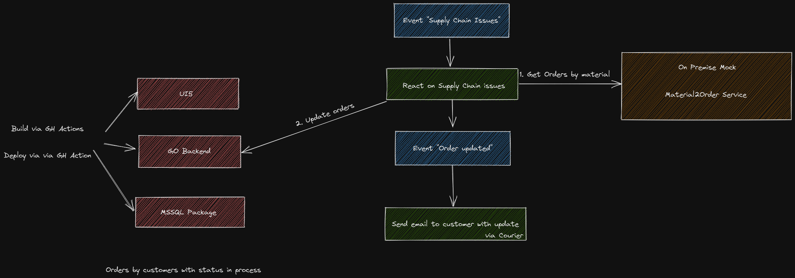

# DSAG Technologietage 2022 - Using Microservices in the SAP BTP, Kyma Runtime to extend SAP Cloud and OnPrem Systems

This is the hands-on tutorial of the DSAG Technologietage 2022. It show how you can leverage the SAP BTP, Kyma Runtime to extend SAP Solution on-premise or in the cloud making use of Microservices and Kyma Functions.

## Scenario

We have several orders that are managed by a microservice. For user-interaction we have a basis UI5 app to create, edit and delete orders. The ordered products depend on the delivery of materials. We assume that we run into a supply chain shortage: some materials cannot be delivered and consequently the orders need to be delayed. The shortage of a material is reported by a message containing the material ID that is running short. The extension developed in this hands-on should therefore:

- Get triggered by the message and read it from a message queue.
- Fetch the corresponding orders for the reported material from an on-premise system.
- Update the order status to "DELAYED" via the order microservice.
- Sent a message to a queue of delayed orders reporting the ID of the order.

As an optional part we develop a second extension that gets triggered by the second message after the order was updated. This extension should:

- Read the order from the order microservice
- Send an email to the customer to provide information about the delay.

> Remark: The scenario is of course simplified and does not reflect the processes in real-life. As our focus is on the technical capabilities of the SAP BTP, Kyma Runtime this over-simplification should be fine.

The components involved in the flow are depicted here:

For this scenario we want to leverage several services available on SAP BTP:

- The [SAP BTP, Kyma Runtime](https://discovery-center.cloud.sap/serviceCatalog/kyma-runtime?region=all) as central extension platform and home for the Kyma Functions with our business logic and the order microservice
- The [SAP Event Mesh](https://discovery-center.cloud.sap/serviceCatalog/event-mesh?region=all) to provide the message queues
- The [Cloud Connector](https://help.sap.com/docs/CP_CONNECTIVITY/cca91383641e40ffbe03bdc78f00f681/e6c7616abb5710148cfcf3e75d96d596.html) in conjunction with the [connectivity proxy](https://help.sap.com/docs/CP_CONNECTIVITY/cca91383641e40ffbe03bdc78f00f681/e661713ef7d14373b57e3e26b0b03b86.html) to connect to a on-premise system.

So from the perspective of SAP components the building blocks can be sketched like this:

In addition we will show how you can deploy artefacts to SAP BTP, Kyma runtime using [GitHub Actions](https://docs.github.com/actions).

## Technical Prerequisites

We wanted to keep the technical prerequisites as small as possible, so for the guided hands-on at the DSAG Technologietage you do not need anything installed on your local machine except for a browser.

If you want to execute things later on your own you need `kubectl` and the `kubelogin` extension installed locally (see [Prerequistes - Kubernetes](https://github.com/SAP-samples/kyma-runtime-extension-samples/tree/main/prerequisites#kubernetes)), as well as an editor of your choice.

## Agenda

## Organizational information

The following sections guide you through the single steps of the tutorial. During the DSAG Technologietage 2022 some steps have already been executed by us and the resources are pre-provisioned. Nevertheless we described the steps as they give some interesting insights. For easier navigation we marked the sections correspondingly:

- Sections marked with 👨‍🔧 contain the hands-on steps you must work on
- Sections marked with 👀 are for your information. They contain some interesting insights but contain no actions you must execute.

> Remark: As the tutorial is done with a group of participants, we need to make sure that we have no conflicts concerning names collisions etc.. If you are running this sample on your own set the the value for "userID" to "01". 

## Tutorial Steps

Let the fun begin 👩‍💻

1. [Step 1 - Set up the order microservice 👀](./tutorial/step1.md)
2. [Step 2 - Set up the on-premise components 👀](./tutorial/step2.md)
3. [Step 3 - Set up the connectivity proxy 👀](./tutorial/step3.md)
4. [Step 4 - Set up the SAP Event Mesh 👨‍🔧](./tutorial/step4.md)
5. [Step 5 - Develop function "trigger supply chain issue" 👨‍🔧](./tutorial/step5.md)
6. [Step 6 - Develop function "update order status" 👨‍🔧](./tutorial/step6.md)
7. [OPTIONAL: Step 7 - Develop function "send delay email" 👨‍🔧](./tutorial/step7.md)
8. [The extra mile: setup order microservice in your namespace 👨‍🔧](./tutorial/step1.md) - If you want to try out CI/CD flows with GitActions, walk through Step 1 on your own and modify the namespace into which you deploy the microservices to your created namespace `dsagtt-handson<userID>`

If you want to walk-through the tutorial later on your own, you must execute each step on you own.
