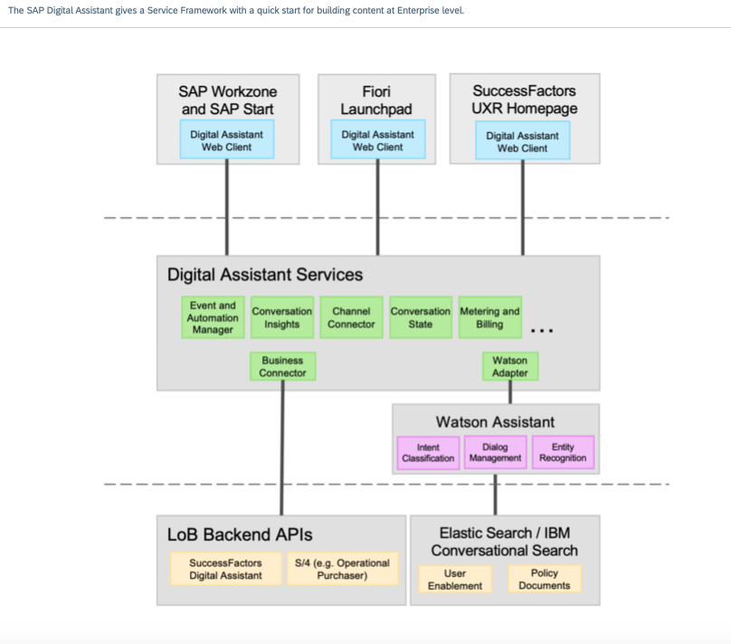

# Digital Assistant Capability Developer Hands On
Training Material to enable Digital Assistant Developers to play with the [SAP Digital Assistant](https://help.sap.com/docs/joule/service-guide/what-is-joule?locale=en-US) Framework to create Digital Assistants.

## SAP Digital Assistant: Architecture Overview

## Tutorial

This tutorial is intended to create a Weather Digital Assistant and is divided into multiple branches.

Each branch is a separate independent logical step. They contain the corresponding code covered in the content available in the readme files of each branch.

Please fine below a brief description and link of each step to create a Weather Digital Assistant using SAP Digital Assistant tools and framework.

### [Set up your environment](https://github.tools.sap/DAS-Samples/da-mc-developers-hands-on/tree/1-Setting-up-the-environment)

Install tools (SAP Digital Assistant Command Line Interface (CLI) and IDE Extension) to enable your Capability Developer Environment.

### [Create your first digital assistant](https://github.tools.sap/DAS-Samples/da-mc-developers-hands-on/tree/2-Create-a-new-Digital-Assistant)

Get familiar with IDE extension tool and Digital Assistant structure. Create your first sample DA capability.

### [Enrich your digital assistant](https://github.tools.sap/DAS-Samples/da-mc-developers-hands-on/tree/3-Enrich-the-created-sample)

Learn how to manipulate intents, entities, dialog nodes & trees by creating a node triggering based on an intent classification and returning an entity value

### [Play with your digital assistant](https://github.tools.sap/DAS-Samples/da-mc-developers-hands-on/tree/4-Play-with-your-BOT)

Get familiar with the Command Line Interface (CLI): login, compile, deploy, dialog.

### [Create extra dialog function](https://github.tools.sap/DAS-Samples/da-mc-developers-hands-on/tree/5-Extra-Create-a-Dialog-Function)

Learn how to create and call a dialog function.

### [Weather Intent and Dialog](https://github.tools.sap/DAS-Samples/da-mc-developers-hands-on/tree/6-Weather-Intent-and-Dialog)

Create a "Weather Capability" by adding intents, dialog nodes and dialog functions to your assistant so that it is able to reply to requests about the weather. In the next part we will then add the API calls to actually fetch the weather information from the IBM weather APIs.

### [Weather Dialog function](https://github.tools.sap/DAS-Samples/da-mc-developers-hands-on/tree/7-Weather-Dialog-Functions)

Call IBM weather APIs in order to look up a city entered by the user and then fetching the current weather information.

### [Weather Capability content testing](https://github.tools.sap/DAS-Samples/da-mc-developers-hands-on/tree/8-Adding-Content-Tests)

Create a Cucumber test file to test the weather_capability capability that provides weather information.

### Tutorial Video

Find the tutorial "Creating a DA weather capability" in video format [HERE](https://sap.sharepoint.com/:v:/r/sites/102567/Shared%20Documents/2.%20Solution%20Assets/Joule/Enablement%20tutorials/SAP%20Digital%20Assistant%20-%20Adding%20a%20Weather%20Capability.mp4?csf=1&web=1&e=u0V1Wk&nav=eyJyZWZlcnJhbEluZm8iOnsicmVmZXJyYWxBcHAiOiJTdHJlYW1XZWJBcHAiLCJyZWZlcnJhbFZpZXciOiJTaGFyZURpYWxvZyIsInJlZmVycmFsQXBwUGxhdGZvcm0iOiJXZWIiLCJyZWZlcnJhbE1vZGUiOiJ2aWV3In19).
